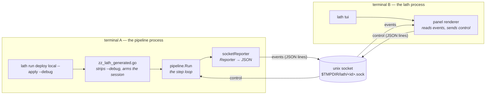
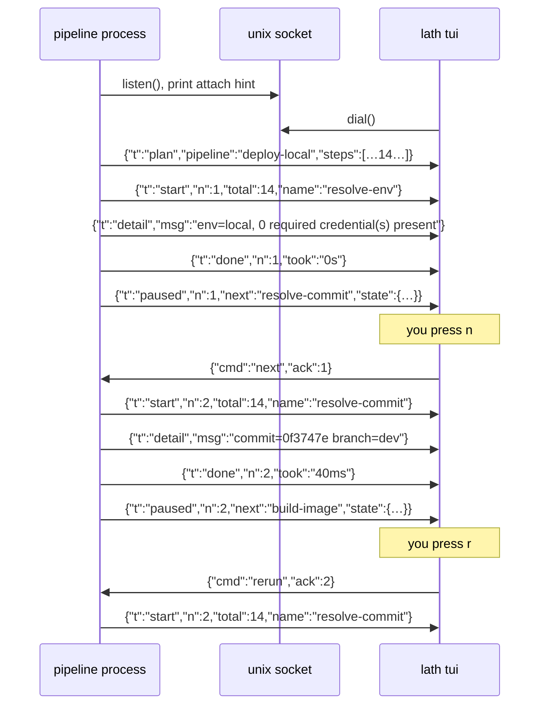

# Spec, the step debugger

**How to use it: [`DEBUGGING.md`](DEBUGGING.md). This page is the design record.**

**Status: BUILT.** All six stages of §14 shipped and were proven against a live session. §15 records where reality pushed back on the design.

```
lath tui                          # pick a target and step through it, here
lath tui deploy local --apply     # step through that, here
lath run <target> --debug         # start it elsewhere; lath tui picks it up
```

Run a pipeline one step at a time, pausing after each until you say to continue, with the option to replay the step that just ran or abandon the run. A separate process renders the panel and sends the keystrokes.

```
$ lath run deploy local --apply --debug        $ lath tui
  waiting for a debugger to attach…              ┌─ acme_api · deploy local ─────────────┐
  attach with:  lath tui                         │ ✓ 1  resolve-env            0s       │
                                                 │ ✓ 2  resolve-commit        40ms      │
                                                 │ ✓ 3  build-image        1m08s        │
                                                 │ ▸ 4  registry-login      paused      │
                                                 ├─ state ──────────────────────────────┤
                                                 │ commit  0f3747e                      │
                                                 │ branch  dev                          │
                                                 │ image   ghcr.io/…/acme_api:0f3747e    │
                                                 ├──────────────────────────────────────┤
                                                 │ n next · r rerun · c continue · q    │
                                                 └──────────────────────────────────────┘
```

---

## 1 · Why two processes

The shape was not chosen for elegance. Three constraints eliminated every one-process design, in this order.

**lath does not exist while your pipeline runs.** `cmd/lath/exec_unix.go` replaces the runner with the compiled definition:

```go
// Invariant: on success this never returns.
syscall.Exec(binPath, argv, os.Environ())
```

That is `exec`, not spawn-and-wait, and deliberately so. The pipeline inherits the terminal and signal disposition directly, so Ctrl-C cannot leave a half-finished deploy orphaned behind a wrapper. Any design where lath draws a panel *around* a running pipeline requires deleting that property.

**Whatever the definition imports, every definition imports forever.** lath generates `zz_lath_generated.go` into the user's `.lath/` package, so it is always compiled and its imports are always dependencies. Putting a TUI library there taxes every project that ever uses lath, including those that never open a debugger, and to avoid that lath would have to rewrite the user's `go.mod` and `go.sum`, which needs the network and dirties their module.

**The engine already anticipated an out-of-process consumer.** `pipeline.Reporter`, written long before this feature:

> a package that writes to `os.Stdout` cannot be imported by a program that wants JSON, cannot be tested without capturing global state, and cannot be embedded in a larger tool.

`Reporter` is the seam the whole events channel hangs on, see [`pipeline/README.md`](pipeline/README.md#reporter--where-output-goes) for how it works and why steps never print.

Splitting the processes satisfies all three. The renderer lives in `cmd/lath`, where a dependency costs only people who install lath. The pipeline side needs `net` and `encoding/json`, both stdlib, so **no definition's `go.mod` changes by a single line**.

### Rejected alternatives

| Approach | Why not |
|---|---|
| TUI inside `cmd/lath`, wrapping the run | `syscall.Exec`. Lath is gone before step 1. Would require becoming a supervisor process, trading away correct signal handling for a menu. |
| TUI library imported by `pipeline` | Lands in every `.lath/go.mod` forever, whether or not it is ever used. |
| `LATH_DEBUG=1` environment variable | Hidden state: the same command behaves differently for an invisible reason. Banned by the kit rules for exactly this. |
| An opt-in line in each definition | Works, but every new pipeline must remember it. The per-project boilerplate a task runner should absorb, not distribute. |
| A `Step` target function per definition | Collides with `pipeline.Step`, the interface the pipeline is already made of, and must be rewritten in every definition. |

---

## 2 · Architecture



Nothing new is invented on the pipeline side: the "server" is a second `Reporter` implementation plus a blocking read between steps.

---

## 3 · The pause mechanism

There is no scheduler trick here. `Pipeline.Run` is a sequential loop, and a blocking read on a socket cannot be advanced past. The proposed change, in full:

```go
func (p Pipeline) Run(ctx context.Context, s *State) error {
    if err := p.Validate(); err != nil {
        return err
    }
    dbg := s.debugger            // nil unless a session was armed
    if dbg != nil {
        dbg.Plan(p.Name, p.Plan())     // PlanEntry already has json tags
    }

    total := len(p.Steps)
    for i := 0; i < len(p.Steps); i++ {
        st := p.Steps[i]
        if err := ctx.Err(); err != nil {
            return fmt.Errorf("pipeline %q: cancelled before step %d (%s): %w",
                p.Name, i+1, st.Name(), err)
        }
        position := i + 1

        s.reporter.StepStart(position, total, st.Name())
        started := time.Now()
        runErr := st.Run(ctx, s)
        if runErr != nil && dbg == nil {
            return fmt.Errorf("pipeline %q: step %d (%s): %w: %w",
                p.Name, position, st.Name(), ErrStepFailed, runErr)
        }
        if runErr == nil {
            s.reporter.StepDone(position, total, st.Name(), time.Since(started))
        }

        if dbg == nil {
            continue
        }
        // BLOCKS until the attached client answers. Nothing to read means
        // nothing to run: the loop physically cannot advance.
        act, err := dbg.Pause(position, st, runErr)
        if err != nil {
            return fmt.Errorf("pipeline %q: debug client: %w", p.Name, err)
        }
        switch act {
        case ActNext:
            if runErr != nil {
                return fmt.Errorf("pipeline %q: step %d (%s): %w: %w",
                    p.Name, position, st.Name(), ErrStepFailed, runErr)
            }
        case ActRerun:
            i--                  // same index next iteration
        case ActContinue:
            dbg = nil            // stop asking; run to the end
            if runErr != nil {
                return fmt.Errorf("pipeline %q: step %d (%s): %w: %w",
                    p.Name, position, st.Name(), ErrStepFailed, runErr)
            }
        case ActQuit:
            return fmt.Errorf("pipeline %q: %w at step %d (%s)",
                p.Name, ErrAborted, position, st.Name())
        }
    }
    return nil
}
```

Note the one behavioural change beyond pausing: **under a debugger a failing step pauses instead of returning**, so you can inspect state and retry after fixing something on the box. Without a debugger the behaviour is byte-identical to today.

---

## 4 · A worked session



---

## 5 · Wire protocol

Newline-delimited JSON, both directions, so a broken TUI can be bypassed with `nc -U` and the transcript read by eye. That debuggability is the whole reason for choosing it over anything binary.

### Events, pipeline to client

| `t` | Fields | Emitted |
|---|---|---|
| `plan` | `pipeline`, `steps[]` (`pipeline.PlanEntry`) | once, on connect |
| `start` | `n`, `total`, `name` | `Reporter.StepStart` |
| `detail` | `msg` | `Reporter.Detailf` |
| `done` | `n`, `total`, `name`, `took` | `Reporter.StepDone` |
| `failed` | `n`, `name`, `err` | a step returned an error |
| `paused` | `n`, `next`, `state{}`, `mutating` | waiting for a decision |
| `finished` | `err` (empty on success) | the run ended |

### Control, client to pipeline

| `cmd` | Meaning |
|---|---|
| `next` | run the next step, pause again |
| `rerun` | run the step that just ran, again |
| `continue` | stop pausing; run to the end |
| `quit` | abandon the run |

Every control message carries `ack`, the step number of the pause it answers.

### Why `ack` exists

Without it, key-mashing silently deploys. Hit `n` four times at step 3 and three extra `next` messages sit in the buffer; the loop reads them one after another and blows through steps 5, 6 and 7 unpaused. On this pipeline step 6 is `start-processes`.

```
P → {"t":"paused","n":3,"next":"build-image"}
T → {"cmd":"next","ack":3}      accepted
T → {"cmd":"next","ack":3}      DISCARDED — pause 3 is over
```

The pipeline discards any control line whose `ack` is not the pause it is currently sitting at. The same rule handles a client that reconnects and replays, and a `nc` session where you typed ahead.

---

## 6 · Sessions and discovery

### Naming

Keyed by **project root and PID**, never by target alone. Two projects both running `deploy local`, or one project run twice, must not collide.

```
$TMPDIR/lath/
  a91f4c2e-38472.sock          ← project-root hash, PID
  a91f4c2e-38472.json          ← metadata
```

```json
{
  "project": "/home/you/projects/acme-api",
  "target":  "deploy local",
  "args":    ["--apply"],
  "pid":     38472,
  "started": "2026-08-26T22:41:07Z"
}
```

### Attaching

```
$ lath tui

  waiting sessions:

    1) acme_api     deploy local --apply     paused 3/14  build-image     12s ago
    2) billing-api    deploy run staging       paused 1/14  resolve-env      3s ago

  attach [1-2]:
```

One waiting session attaches immediately with no prompt. A numbered menu, not an arrow-key picker: `cmd/lath` has zero dependencies today (`cmd/lath/go.mod` has no `require` block) and a numbered list needs only `fmt` and `bufio`, where raw-mode navigation would need termios handling duplicated into the runner.

### Liveness

A crashed run leaves its socket behind. `kit/lock` already solves precisely this. It records **PID and process start time**, so a recycled PID cannot be mistaken for a live holder, and session liveness reuses it rather than reinventing it. Dead sessions are swept from the listing, and their socket files removed.

---

## 7 · Failure modes

Each is a decision, not an omission. A debugger that hangs a deploy is worse than no debugger.

| Situation | Behaviour |
|---|---|
| `--debug` with no TTY anywhere (CI) | Refuse at startup, before any step runs, naming the flag. Never wait. |
| Nobody attaches | Wait `DefaultAttachTimeout` (30s), printing the attach command, then exit non-zero. |
| Client disconnects mid-run | The blocking read fails. Abort the run rather than silently completing it. The operator asked to supervise, and losing supervision is not consent to proceed. |
| Client crashes between steps | Same path; the pipeline never continues unattended. |
| Stale socket from a dead run | Detected via `kit/lock`, removed, and the new session takes the path. |
| Live socket, same project, second run | Different PID, so a different path. Both listed. |
| Ctrl-C in the pipeline terminal | Existing signal handling. Context cancels, checked at the next boundary. |
| Ctrl-C in the TUI | Client detaches cleanly, sending `quit`. |
| `quit` | Pipeline returns `ErrAborted`, non-zero exit. Steps already run are **not** undone. |

---

## 8 · Rerun, honestly

`rerun` replays a step. **It does not undo one.**

State is snapshotted before each step and restored on rerun, so the step re-executes against identical inputs. That part is real and exact, but nothing can un-`docker run` a container or un-write a file on the box. Rerunning `start-processes` starts a *second* container.

So steps declare whether they are safe to replay, through an optional interface. No existing step is forced to change, and one that says nothing is assumed unsafe:

```go
// Replayable is an optional upgrade a Step may implement to say that running
// it twice is indistinguishable from running it once.
//
// Why an optional interface rather than a field on Step: every existing step
// keeps compiling, and a step that has not thought about the question is
// treated as unsafe — the honest default, since the cost of wrongly assuming
// safe is a duplicate container and the cost of wrongly assuming unsafe is
// one keystroke.
type Replayable interface {
    // Replayable reports whether re-running this step is idempotent.
    Replayable() bool
}
```

Read-only and compute steps implement it and return true, `ResolveEnv`, `ResolveCommit`, `Build`, `WaitHealthy`, `EnsureDir`, `PutFile`. Mutating ones do not, and the client confirms first:

```
▸ rerun 6/14 start-processes

  ⚠ this step is not marked replayable.
    already started: acme-prod-api-0f3747e-0
    replaying will start ANOTHER container.

  rerun anyway? [y/N] ▸
```

**`back`, stepping backwards, is rejected outright.** It would have to claim side effects were undone, and in a tool whose entire point is that a deploy behaves the way the plan said, a lie is worse than a missing feature.

---

## 9 · State inspection

`paused` carries the state bag, which is most of why stepping is worth having. Values are rendered through `fmt`, which means `secret.Value` redacts itself, its `String`, `GoString`, `Format`, `MarshalJSON`, `MarshalText` and `LogValue` are all closed, and `Reveal()` is the only door. A credential in pipeline state cannot reach the panel by accident.

```
├─ state ──────────────────────────────────────┤
│ commit      0f3747e                          │
│ branch      dev                              │
│ env         local                            │
│ image       ghcr.io/acme/acme_api:0f3747e│
│ containers  [acme-local-api-0f3747e-0]       │
└──────────────────────────────────────────────┘
```

A key holding a secret would render as `secret.Value(len=2897)`, never its contents. **This must have a test**, because it is a redaction claim, and a redaction claim nobody exercised is not a guarantee.

---

## 10 · API surface

Everything new, in one place.

### `pipeline`, new

```go
// Action is a debugger's decision at a pause.
type Action string

const (
    ActNext     Action = "next"
    ActRerun    Action = "rerun"
    ActContinue Action = "continue"
    ActQuit     Action = "quit"
)

var ActionValues = []Action{ActNext, ActRerun, ActContinue, ActQuit}

func (a Action) Valid() bool

// Debugger is consulted between steps. Implementations block.
type Debugger interface {
    Plan(pipeline string, steps []PlanEntry) error
    Pause(position int, step Step, runErr error) (Action, error)
    Finish(err error) error
}

// Replayable is the optional Step upgrade described in §8.
type Replayable interface{ Replayable() bool }

// Debug attaches d to a State. Without it, Run behaves exactly as today.
func Debug(d Debugger) StateOption

func NewState(mode Mode, r Reporter, opts ...StateOption) *State
```

`NewState` gains a variadic parameter, so every existing call site compiles unchanged.

### How the debugger reaches the State, decided

`NewState` is called *inside the definition* (`targets.go`), while the generated dispatcher runs *before* it, so the generated code cannot pass an option in. **Resolved in favour of automatic arming**: the dispatcher stores the debugger where `NewState` picks it up.

```go
// zz_lath_generated.go — written by lath, readable with cat
if debugging {
    pipeline.AttachDebugger(dbg)
}
```

```go
// AttachDebugger arms every State created afterwards in this process.
//
// Why a package-level rather than an argument: NewState is called inside the
// author's definition, which the generated dispatcher cannot reach into. The
// alternative — an opt-in argument in every definition — fails silently when
// forgotten, and --debug quietly doing nothing is the worst failure shape for
// a debugging tool.
//
// Invariant: set once at startup, from an explicit flag, by generated code.
// Never persisted, never read from the environment, and cleared by process
// exit. This is deliberately narrower than the hidden state the kit rules ban,
// which is state living on a machine and making the same command behave
// differently without saying so.
func AttachDebugger(d Debugger)
```

Definitions change by **zero lines**, and every pipeline, including ones written later, gets stepping for free.

### `pipeline/debug`, new package, stdlib only

```go
// Serve listens on a session socket and returns a Debugger that speaks the
// protocol in §5. Blocks until a client attaches or timeout elapses.
func Serve(ctx context.Context, s Session, timeout time.Duration) (pipeline.Debugger, error)

// Session identifies one debuggable run.
type Session struct {
    Project string
    Target  string
    Args    []string
}

// List returns the live sessions, sweeping dead ones.
func List() ([]Live, error)

// Dial attaches to a session as a client.
func Dial(id string) (*Client, error)

func (c *Client) Events() <-chan Event
func (c *Client) Send(cmd Action, ack int) error
func (c *Client) Close() error

const DefaultAttachTimeout = 30 * time.Second
```

### `cmd/lath`, new

- `--debug` recognised, stripped from `os.Args`, session armed in the generated dispatcher
- `lath tui`, list, attach, render, send

Nothing in `cmd/lath` imports `kit`, `pipeline` or `steps`. It keeps its empty `require` block.

---

## 11 · Scope

| | Item | Decision |
|---|---|---|
| 1 | `next` | **in** |
| 2 | `continue` | **in** |
| 3 | `rerun`, with the replayable guard | **in** |
| 4 | `quit` | **in** |
| 5 | step list with a cursor | **in** |
| 6 | state pane, redacted | **in** |
| 7 | pause on failure rather than abort | **in** |
| 8 | `lath tui` session picker | **in**, needed once two projects can run at once, not sugar |
| 9 | `dry`, run one step in dry-run, then decide | **defer**, wants a per-step mode override, which `State` does not have |
| 10 | `skip` a step | **defer**, breaks downstream `Requires`; needs a real refusal path |
| 11 | breakpoints (`run to <step>`) | **defer**, `next` plus `continue` covers it until pipelines get long |
| 12 | `back`, step backwards | **rejected**, see §8 |
| 13 | one TUI multiplexing several sessions | **defer**. A different feature; run two |
| 14 | attach over the network | **rejected for now**. A unix socket is filesystem-permission-scoped; TCP is a remote-control channel for deploys and needs auth designed, not bolted on |

---

## 12 · Testing

The protocol is designed to be testable without a terminal, which is why the split is JSON-over-socket rather than a callback.

- **A scripted fake client** drives whole pipelines with no TTY: feed `[next, next, rerun, continue]`, assert the step sequence. This covers the loop, `rerun`'s index arithmetic, and `continue` disarming.
- **`ack` discarding**, write four `next` lines at one pause, assert exactly one step advanced. This is the key-mashing bug; it must fail without the check.
- **Client disconnect mid-pause**, close the socket, assert the run aborts rather than completing.
- **No client**, assert the timeout fires, exits non-zero, and no step ran.
- **Redaction**, put a `secret.Value` in state, pause, assert the plaintext appears nowhere in the socket bytes.
- **Stale session**, write a session file with a dead PID, assert it is swept and not listed.
- **Non-TTY refusal**, assert `--debug` fails before step 1.
- Every gate verified by breaking it first.

---

## 13 · Decisions

Settled in review:

| | Decision |
|---|---|
| Arming | **Automatic**. The generated dispatcher calls `pipeline.AttachDebugger`. Definitions change by zero lines. |
| Step failure under `--debug` | **Pause, do not abort.** The run stops at the failed step showing the error; fix the box and press `r`. Normal runs abort exactly as today. |
| Flag name | **`--debug`**, leaving room to carry more than stepping later. |
| Client disconnect | **Abort the run.** The operator asked to supervise, and losing supervision is not consent to proceed. |
| Attach timeout | **30s**, then exit non-zero. Long enough to switch terminals, short enough not to look hung. |

The last two were proposed rather than debated; say so if either is wrong, since both are one-line changes now and behavioural surprises later.

## 14 · Build order

Sequenced so each stage is verifiable before the next depends on it, and so the terminal is the *last* thing involved rather than the first.

1. **`Debugger` interface, `Action`, the loop change, `AttachDebugger`.** Testable with an in-process fake. No socket, no terminal. Covers `rerun`'s index arithmetic, `continue` disarming, pause-on-failure, and that an unarmed pipeline behaves byte-identically to today.
2. **`Replayable` on the existing steps**, plus the confirmation path.
3. **The protocol**, `socketReporter`, the control reader, `ack` discarding. Testable over an `net.Pipe()` with no filesystem.
4. **Sessions**, socket naming, metadata, `kit/lock` liveness, sweeping.
5. **`--debug` in the generated dispatcher**, including the non-TTY refusal.
6. **`lath tui`**, listing, attach, panel. Last, because everything under it is already proven.

Stages 1–4 are fully testable headless. Only stage 6 needs a terminal.

---

## 15 · What changed while building

The design held, with six corrections. Four came from tests, two from watching a real session, which is the argument for having built the transport before the panel.

### Found by using it

**`lath tui` required a run to already exist.** The first thing anyone tried was `lath tui` on its own, and it failed with "no debug session is waiting", turning the common case, *I want to step through this*, into a two-terminal ritual with a two-minute timeout in the middle. `lath tui` now starts the run itself when nothing is waiting: it picks a target, advertises the session under its own PID, spawns `lath run` as a child with the socket passed straight through, and attaches. One terminal, no flag. The two-terminal form still works and is what you want when the run must happen somewhere this terminal is not.

The child's own output goes to a log rather than the terminal, because the panel already receives every step boundary and detail line over the protocol, letting the child also write here would scribble over the panel it is being rendered into.

**The wait started before the target had validated anything.** `lath run deploy run prod --debug` announced "waiting for a debugger", the operator attached, and was then told `"prod" is protected; pass --allow-prod`. The debugger is now armed *lazily*: `AttachDebuggerFunc` defers accepting until the first `NewState`, so a bad argument fails in under a second and the wait happens only when a pipeline is genuinely about to run.

**`lath tui` failed on a target that builds no pipeline.** Picking a target that does its work without ever constructing a `Pipeline`, writing a file, printing a plan, reported "the run ended before this could attach". The generated dispatcher opens its socket as soon as it sees the flag and only *accepts* lazily, so dialling succeeded, no event ever arrived, and the child eventually exited. The message was wrong and so was the premise. `lath tui` now streams a launched run's output to the terminal until a session opens and passes its exit status through: it behaves like `lath run` whenever there is nothing to step, and takes the screen only when there is. That is also why the picker can honestly list every target, whether one builds a pipeline is decided by the code inside it at run time, not by anything visible beforehand.

**Reaping the launched run through a one-shot channel deadlocked it.** The exit is observed twice, once while waiting for a session, once when reporting the status, and the second receive had nothing left to read. A closed channel broadcasts instead; the error is read after the close, which the happens-before makes safe.

**Thirty seconds was too short.** Chosen by reasoning about how long it takes to switch terminals; the first real attempt missed it, because the actual sequence is read the message, find the other terminal, and type, often while the run is still compiling and not being watched. Now two minutes, with `--debug=10m` as the escape hatch.

**The panel stayed blank until the first pause.** On a pipeline whose first step is a two-minute docker build that is indistinguishable from a hang. It now renders on the `plan` event, the moment it attaches.

**An immediate EOF reported itself as a read error.** `lath: session ended: EOF` says nothing about the cause, which is almost always a run that timed out waiting. It now says so, and how to avoid it.

### Found by running it

**No pause after the last successful step.** The first live session ended in `FAILED` after every step had succeeded: there was still a pause at the end, closing the panel there abandoned the run, and an abandoned run is an error. There is nothing to decide once the last step is done, so the pause is gone. A failure still pauses wherever it happens, retrying is the whole reason for pausing on failures, and the final state now rides on the `finished` event instead, which is why `Finish` takes a `Finished` struct rather than a bare error.

**Output did not reach the client.** The panel showed pauses and nothing else: no step boundaries, no detail lines, and the last step never got its tick. A definition builds its own `State` with its own `Reporter`, and the generated dispatcher runs before that call and cannot reach into it. The fix keeps the promise intact, `NewState` now wraps the caller's Reporter alongside the debugger's whenever one is armed (`ReporterSource`), so a definition still changes by zero lines and the terminal it was started in keeps scrolling exactly as before. Passing the debugger's reporter explicitly is detected and not applied twice (`DebugReporter`).

### Found by tests

**`net.Pipe` cannot model a socket.** It has no buffering, so writing a second control blocks until the first is read, which deadlocks the exact test that matters, an operator with queued keystrokes. The protocol tests run over a loopback pair instead.

**The obvious ack test proved nothing.** Mashing `next` at every pause and asserting the step order passes with the ack check REMOVED, because the surplus controls simply become the answers to later pauses. The test now has the operator go silent after the first pause: with the check the run stalls and aborts, without it the queued keystrokes drive the pipeline onward. It fails when the guard is deleted, which is the only evidence that counts.

**`Advertise` did not secure an existing directory.** `MkdirAll` leaves an existing directory's mode alone, so a session directory that already existed world-readable would have been used as-is, for a directory holding control channels into running deploys. `session.Dir` now enforces the mode and refuses when it cannot.

### Found by using it on a real deploy

**`n` at a failed step ended the run.** Nine steps, nine presses of `n`, then step ten failed and the tenth `n` did what it always had, advanced, which with nothing left to advance to meant giving up. The operator had a container to fix and a retry waiting, and got neither. The keys a pause offers now depend on whether the step failed: `n`, `c` and Enter are neither shown nor accepted there, leaving `r` retry and `q` give up, both of which say what they do. `keyActions` carries the failure-mode labels so the prompt and the parser cannot disagree about it.

**Giving up was reported as abandonment.** `q` after a failure produced `run abandoned at step 10`, naming the operator's choice rather than the container that would not start. Both `q` and a stray `next` now report the step's own error, and the log points at the thing to investigate.

**`continue` threw the debugger away.** It set `dbg = nil`, so a failure after a `c` aborted the run with no pause, at the one moment a pause is worth the most. It now only stops asking between steps that SUCCEED; failures pause regardless.

**Terminal mode swallowed the errors it was meant to make visible.** See [`kit/docker.md`](kit/docker.md), the terminal now goes only to the subcommands that draw progress.

### Placement corrections

**Sessions live in `kit/session`, not `pipeline/debug`.** Liveness needs `kit/lock`'s process-start-time check, and `pipeline` depends on nothing. A property worth more than the convenience. `pipeline/debug` stayed stdlib-only, which is what keeps every definition's `go.mod` untouched.

**`cmd/lath` no longer links nothing of ours.** It now requires `kit` and `pipeline`, because `lath tui` must speak the protocol and discover sessions. The cost was moved deliberately: the runner is one binary a user installs, whereas the alternative, putting the client side in the definition, taxes every project that ever uses lath.

### Additions

- `pipeline.Func.Idempotent`. The inline escape hatch had no way to declare itself replayable, so every `Func` step prompted before a rerun.
- `steps` classification, twelve steps declare `Replayable`; `Start` and `RunOnce` deliberately do not, and a test asserts the whole list because it is a safety claim, not an implementation detail.

### Unchanged from the design

Two processes, unix socket, newline-delimited JSON, the `ack` rule, automatic arming, `--debug`, pause-on-failure, disconnect-aborts, 30s attach timeout, the non-TTY refusal, one client per session, and `back` still rejected.
